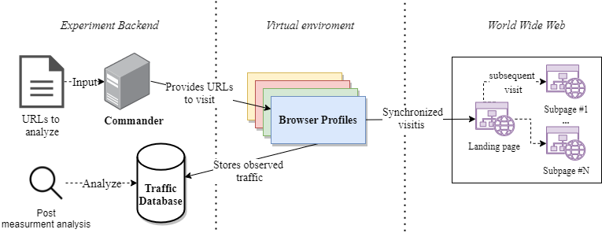

## Table of Contents 
- [MultiCrawl (v0.1.2)](#multicrawl-v012)
  - [Getting Started](#getting-started)
  - [Installation \& Configuration](#installation--configuration)
  - [Running the Framework](#running-the-framework)
  - [Acknowledgements](#acknowledgements)

# MultiCrawl (v0.1.2) 

MultiCrawl is a framework designed for running web measurements with different crawling setups across multiple machines, enabling near real-time website crawling with browsers like Firefox and Chrome. MultiCrawl also automates interactions with consent banners on websites and recognizes tracking requests. All measurement data is pushed to BigQuery for analysis.

We provide an overview of the measurement setup in the following figure:

Initially, we establish a PostgreSQL database and upload our site list. Next, we generate various Virtual Machines (VMs), such as on Google Cloud, tailored to our needs. We install and individually configure the framework in each VM, specifically adjusting browser settings. 

You can tailor the framework to crawl websites with various or singular browser configurations based on your needs. Each distinct configuration requires one VM, while a single browser setup needs only one VM.

Suggested resources per VM:
- 4 vCPUs
- 16 GB RAM
- 80 GB SSD

**Supported Browsers**: Chrome, Firefox

**Collectable Data Types**:
- Cookies
- LocalStorage
- Requests
- Responses
- DNS Responses
- Callstacks
- JavaScript calls

## Getting Started

Before diving into the installation process, ensure you have the prerequisites ready:
- PostgreSQL database
- Authentication JSON for Google Cloud API (BigQuery)
- Sites to visit (e.g., Tranco list)
- VM environment (e.g., Ubuntu 20.04) 

## Installation & Configuration

1. Initialize your PostgreSQL database using the `/resources/db_schema_postgres.sql` script.
2. Update the PostgreSQL connection string in the `/DBOps.py` file.
3. Save your Google Cloud API's `authentication JSON` as `google.json` in `/resources` ([Guide](https://cloud.google.com/docs/authentication/getting-started)).
4. Import your list into the `sites` table of PostgreSQL.
5. Use `/Commander_extract_Subpages.py` to extract subpages from your imported list.
6. Prepare your BigQuery dataset with the tables `requests`, `responses`, `cookies`, and `localstorage`. For column definitions, refer to `resources/db_schema_bigquery.md`.

## Running the Framework

1. Set up an Ubuntu 20.04 VM on your preferred cloud provider or locally.
2. Clone this folder on the VM and install the required Python and Conda packages from `/req-pip.txt` and `/req-conda.txt` in the VM.
3. Execute `install.sh` for OpenWPM installation.
4. Configure a VPN connection on your VM (if needed).
5. Name your VMs according to the `getMode()` function in `/setup.py`. Note that each VM needs a unique name and that the name must be the same as the VM's hostname which is also should be defined as in `/setup.py`.
6. Adjust the crawling preferences in the `getConfig()` function in `/setup.py` (if needed).
7. Execute `restart.sh` on every VM to start the measurement.

## Acknowledgements

This repository incorporates files from [OpenWPM](https://github.com/openwpm/OpenWPM), utilizing OpenWPM (v0.20) for Firefox operations.

 